# Myth Forge — MTG Commander Deck Builder

A fully local web app that builds themed 100-card EDH Commander decks with AI-generated custom card art and proxy frames using real MTG card assets.

> **Now includes the MythGauntlet engine.** Myth Forge builds and prints; the engine at
> `src/mythgauntlet/` measures — it simulates thousands of games to produce a six-axis Power
> Profile and a 1–5 Commander bracket calibrated against author-labeled decks, plus an advisor
> that ranks upgrades from cards you already own. There is exactly one analysis implementation
> in this repo, and when the engine isn't running the UI says a number is unavailable rather
> than guessing. Owned-card features read the shared collection written by **MythScanner**.
>
> ⚠️ **The engine's ~30k compiled card semantics are NOT included** — that store is still being
> trained and is withheld for now. The engine runs without it on Oracle-text fallbacks, with
> reduced fidelity. See **[docs/ENGINE_DATA.md](docs/ENGINE_DATA.md)** for exactly what's missing
> and how to build your own.

[](https://www.buymeacoffee.com/onemorethan0)

> Myth Forge is free and fully local. If it saved you a stack of proxy cash, [buying me a coffee](https://www.buymeacoffee.com/onemorethan0) ☕ helps keep it improving.

---

## Gallery

Every card below came out of the same pipeline: pick a commander, describe a world, and Myth Forge builds a legal 100-card EDH deck with themed names, flavor text, custom AI art, and print-ready proxy frames.

**Five commanders, five worlds** — fae dog-trainers, a 40K-inspired hive city, a rusted desert wasteland, a neon Halloween city, and ink-wash samurai:

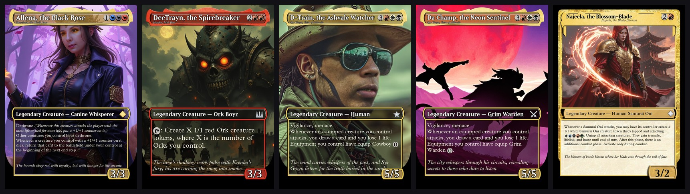

**One card, four worlds** — the *same* commander (Syr Gwyn, Hero of Ashvale) rethemed into four different decks. The rules stay identical, but the name, art, flavor — even the creature types in the rules text ("equip **Cowboy**", "equip **Grim Warden**") — follow each world, and the subtitle always shows the real card:

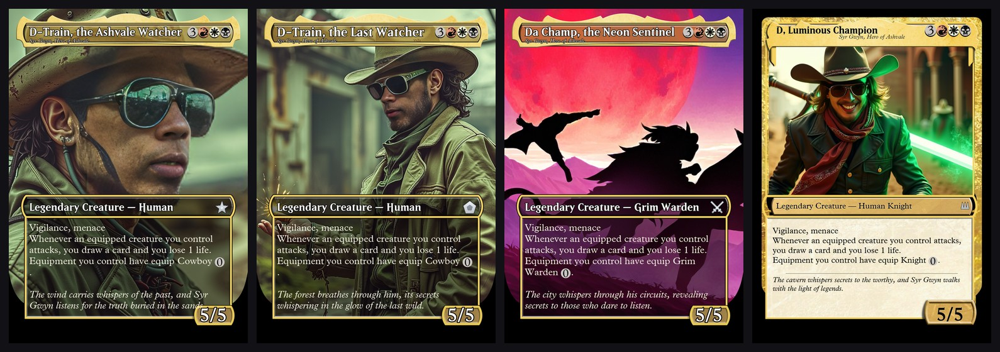

### The borderless treatment

Full-bleed art edge to edge, floating legend crowns on legendaries, white title / type / P&T in the official borderless convention, and the proxied card's real name as a subtitle — across every card type:

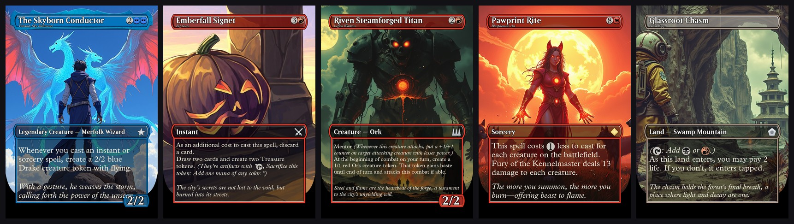

### The commander wears your face

Upload 1–5 photos on the Face step and the commander (plus a few humanoid crew cards) renders with your likeness — in any theme, any art style. All five borderless commanders below were generated from the same person's reference photos:

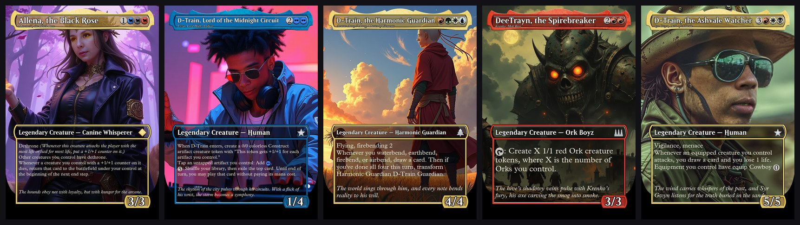

### Theme showcase

A taste of thirteen sample decks (commander + a creature + a spell or land each). Full 10-card samples per deck — commander, 3 creatures, 3 spells, 3 lands — are generated by [`utilities/generate_samples.py`](utilities/generate_samples.py). Borderless decks first:

**🐕 A fae realm of canine trainers and supernatural dogs** — FLUX · borderless · face commander · custom paw-print mana pips:

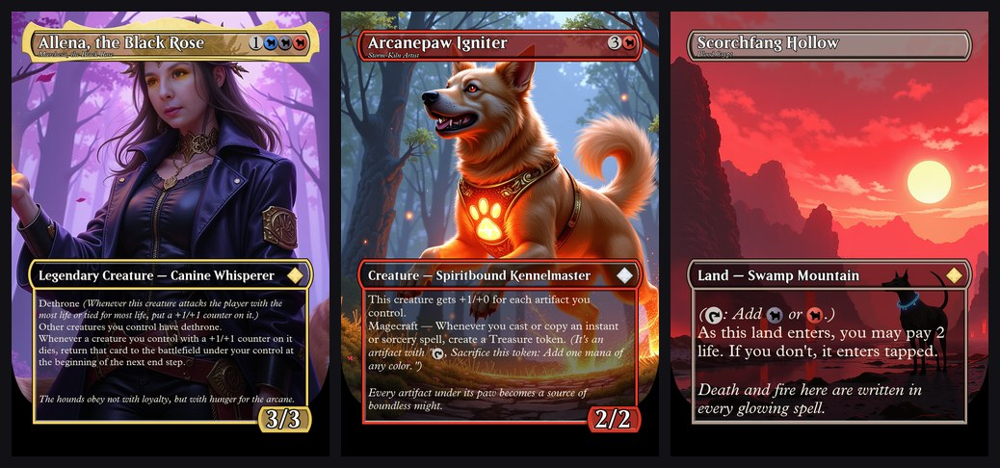

**🌆 Green & black cyberpunk rave** — anime-illustrated · borderless · face commander:

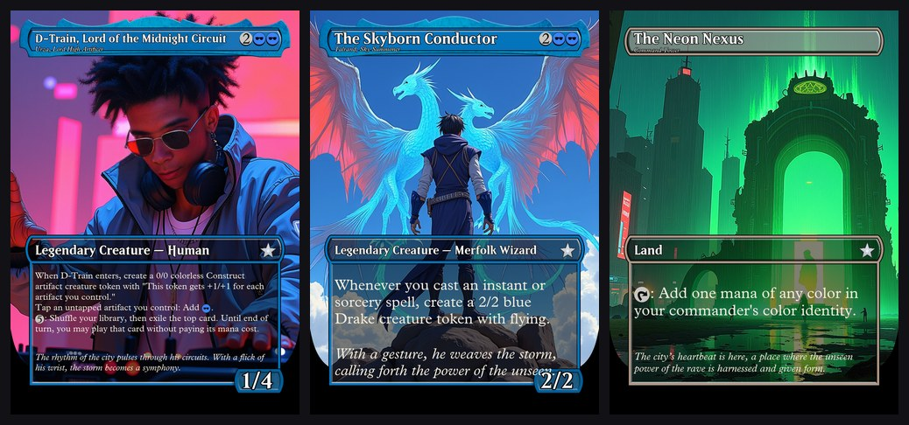

**🎵 A world where music is magic** — painterly illustrated · borderless · face commander:

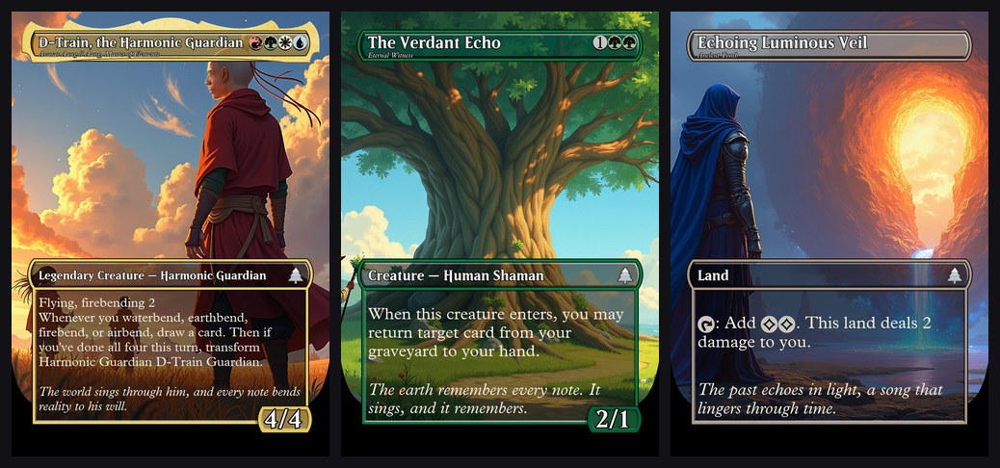

**🏭 Hive city (Warhammer 40K-inspired)** — gothic horror · borderless · face commander:

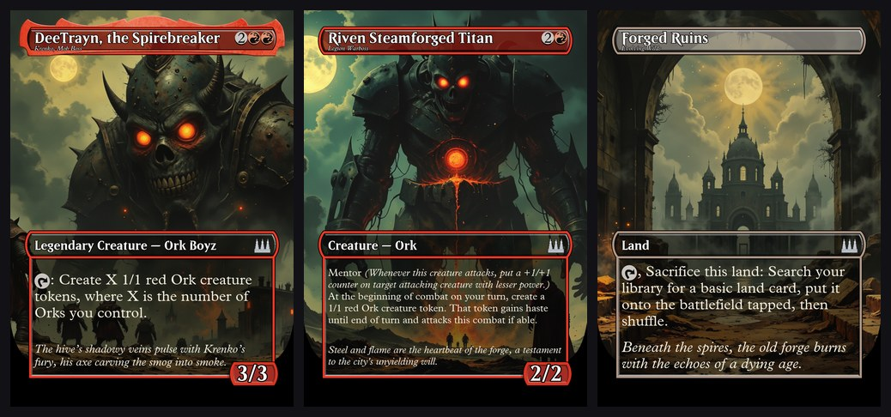

**🏜️ Western desert wasteland** — retro-future · borderless · face commander:

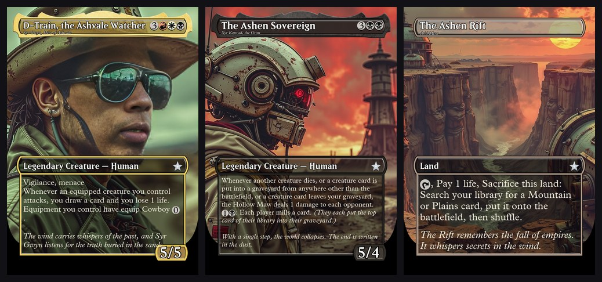

**🌱 The last green hole on earth** — overgrown post-apocalypse · borderless · face commander:

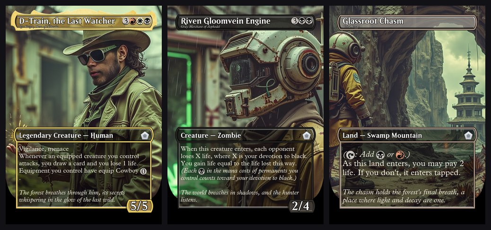

**🎃 Prontera City at Halloween (Ragnarok Online-inspired)** — borderless · face commander:

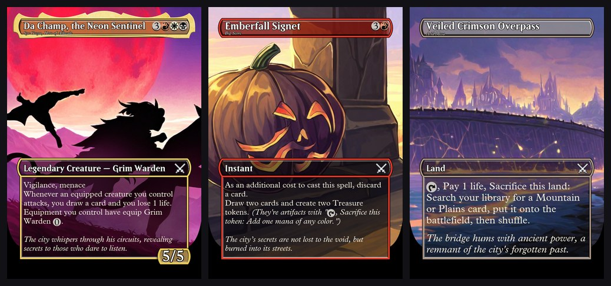

**💎 Underground crystal kingdom** — photorealism · built-in frames · face commander:

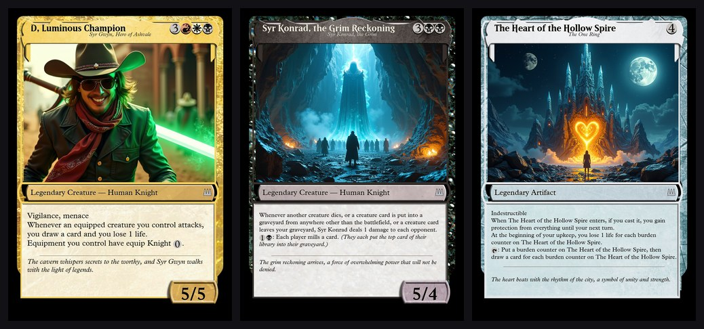

**⚔️ Feudal Japan in ink-wash and gold leaf** — built-in frames:

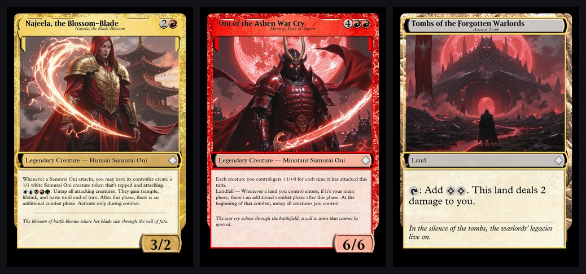

**😈 Devil May Cry New York** — cel-shaded anime:

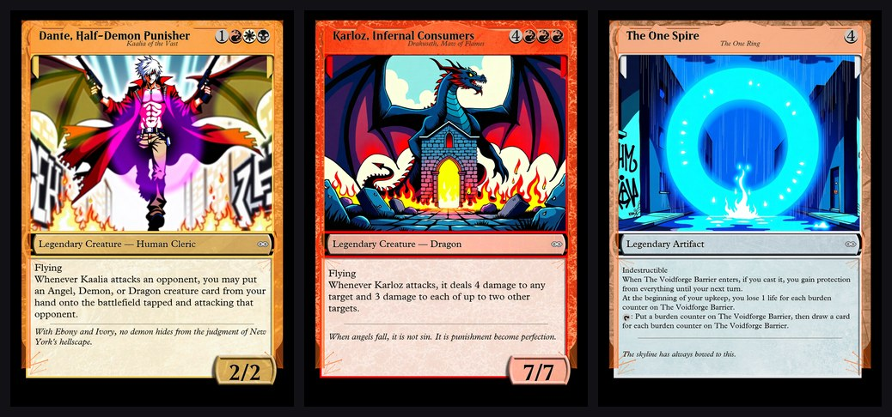

**🏘️ A cozy cobblestone hamlet:**

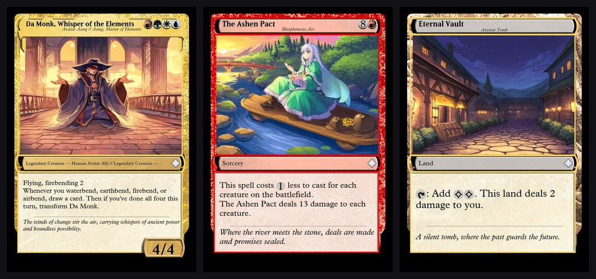

**👼 Midgard guild adventures (Ragnarok Online-inspired):**

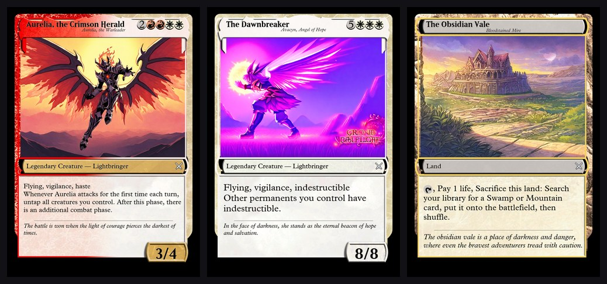

**🛡️ An ironclad champion of Midgard:**

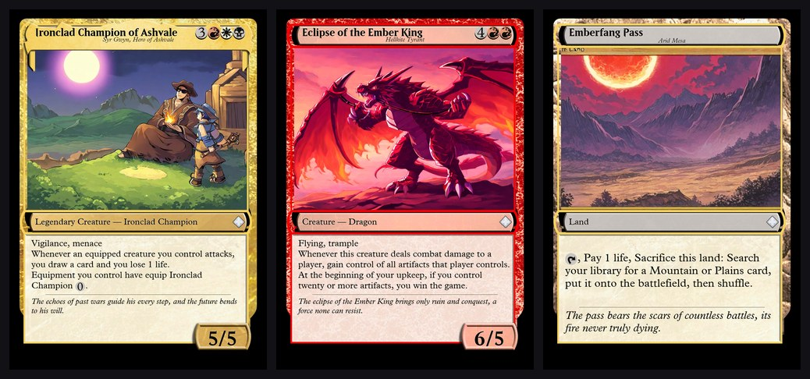

> All art above is generated **locally** (FLUX / SDXL via ComfyUI) and composited into print-ready proxy frames. The borderless cards were rendered against a locally-installed [Card Conjurer](#optional-official-style-m15-frames-card-conjurer)'s frame assets — **this repo bundles no Wizards-copyrighted frame artwork**; the built-in frames (e.g. the samurai deck) ship with the app.

---

## System Requirements

> ### 🚀 No big GPU? Try it in "quick-look" mode first
> You do **not** need ComfyUI or a 24 GB GPU to see the core experience. Install the app, **leave the "Generate AI art" toggle OFF** on the Theme step, and Myth Forge will theme the whole deck (custom names, flavor text, creature-type reskins) and render **print-ready proxy frames using real Scryfall card art** — no FLUX, no ComfyUI. Only the *custom AI art* needs a GPU + ComfyUI; everything else (theming, frames, ZIP/PDF export) runs on modest hardware. Theming uses a local LLM (llama.cpp or Ollama), which can run a smaller model or on CPU.

**Developed & Tested On (full AI-art pipeline):**
- **GPU**: NVIDIA RTX 3090 (24GB VRAM)
- **CPU**: AMD Ryzen 5800X3D
- **System RAM**: 32GB

**Performance on RTX 3090 + 32GB:**
- 100-card build with FLUX Schnell: ~18-20 minutes
- 100-card build with FLUX Dev (premium quality): ~70-75 minutes
- Peak memory usage: 2-3 GB system RAM, 12-14 GB VRAM

**Other Systems:**
- RTX 4080 (16GB): Use FLUX Schnell only, ~20-30% slower
- RTX 4070 (12GB): Use FLUX Schnell, marginal fit
- Smaller GPUs: Fallback to Scryfall artwork (no FLUX generation)
- Mac M-series: CPU-only generation, much slower

See [docs/HARDWARE_OPTIMIZATION_GUIDE.md](docs/HARDWARE_OPTIMIZATION_GUIDE.md) for detailed analysis and batch size tuning.

---

## Services Required

| Service | Port | Purpose |
|---------|------|---------|
| FastAPI / Uvicorn | 8000 | Backend API + serves React frontend |
| Local LLM — **llama.cpp via llama-swap** (default) or **Ollama** | 8010 / 11434 | Card theming, names, flavor text, art prompts (`qwen3:14b` default) |
| ComfyUI | 8188 | AI image generation (FLUX or SDXL) |
| **MythGauntlet engine** (`src/mythgauntlet`) | 8020 | Deck strength, bracket, upgrade advisor. Started by `manage.bat`. Separate process on purpose — it holds the card-semantics store in memory (~50s cold, ~1.4s warm) so the web server restarts stay fast |

> **LLM backend:** Myth Forge talks to an **OpenAI-compatible endpoint** — by default a [llama-swap](https://github.com/mostlygeek/llama-swap) gateway in front of `llama-server` (llama.cpp), which auto-loads GGUF models on demand and unloads them when idle. Prefer **Ollama**? Set `MYTHFORGE_LLM_BACKEND=ollama` and it works exactly as before — easiest path for a first install. `MYTHFORGE_LLM_BASE` overrides the endpoint URL.

---

## Quick Start

### 1. **First-Time Setup** (One Time Only)

**Windows:**
```cmd
setup.bat
```

**Mac/Linux:**
```bash
python install.py
```

This will:
- ✓ Install Python dependencies
- ✓ Install frontend dependencies  
- ✓ Build the frontend
- ✓ Create necessary directories

**Expected time:** 2-5 minutes

### 2. **Download Models** (One Time Only)

**Windows:**
```cmd
manage.bat
→ Option 8: Download AI models
```

**Mac/Linux:**
```bash
python download-models.py
```

Choose which models to download (see [MODELS.md](./MODELS.md) for details).

### 3. **Start the Server**

**Windows — one click (recommended):** double-click **`START MYTH FORGE.bat`** in the repo
root (or the **"Myth Forge"** desktop shortcut). It auto-starts every backend the app needs —
the llama-swap theming LLM (:8010) and the MythGauntlet strength API (:8020) — then serves the
app. `manage.bat start` does the same from a terminal.

**Or via the menu:**
```cmd
manage.bat
→ Option 1: Start server
```

**Mac/Linux:**
```bash
python server.py
```

Then open your browser to: **http://localhost:8000**

### 4. **Check Service Status**

**Windows:**
```cmd
manage.bat status        (or: manage.bat → Option 4)
```

Shows status of:
- ComfyUI (port 8188) — card art; optional, start via `manage.bat` Option 3
- llama-swap LLM gateway (port 8010) — deck theming
- MythGauntlet strength API (port 8020) — simulation-grounded deck analysis
- Myth Forge (port 8000) — the app itself

> **Note:** starting the server auto-starts llama-swap and the strength API if they aren't
> already listening. ComfyUI is only needed for image generation and starts separately.

---

## Server Management

**See [SCRIPTS.md](./SCRIPTS.md) for:**
- Complete menu options
- Common workflows
- Troubleshooting
- Direct command access

**"Port 8000 already in use"?**
```cmd
netstat -ano | findstr :8000
taskkill /PID <process_id> /F
```

**ComfyUI not detected?**
- Ensure ComfyUI is installed and running on port 8188
- Start manually: `python ComfyUI/main.py --port 8188`

**LLM backend not detected?**
- **Simplest:** install [Ollama](https://ollama.ai), `ollama pull qwen3:14b`, `ollama serve`, and set `MYTHFORGE_LLM_BACKEND=ollama`.
- **Default (llama.cpp):** run a [llama-swap](https://github.com/mostlygeek/llama-swap) gateway on `127.0.0.1:8010` pointing at your GGUF models (any OpenAI-compatible `llama-server` works; `MYTHFORGE_LLM_BASE` overrides the URL).

**Server not responding?**
- Check `server.log` for errors
- Ensure Ollama/ComfyUI ports aren't blocked
- Try stopping and restarting the server

---

## Optional: Model & Image Generation Setup

See **[MODELS.md](./MODELS.md)** for detailed instructions on downloading:
- **Checkpoints** (FLUX, SDXL, SD 3.5) for image generation
- **LoRAs** (MTG v2, Composition, Realism, etc.) for style enhancement
- **Face conditioning** (PuLID, ReActor) for character art

The app works with any checkpoint you have installed. Start with FLUX Schnell for good quality and speed.

---

## User Flow (4 steps)

The deck list is generated **up front** (step 1), so the theme step can show the
deck's real creature types for per-tribe reskinning.

1. **Commander & Deck** — Either **Generate a deck** (search any legendary creature; pick **power bracket 1–5** and a **playstyle** — Aggro, Control, Lifegain, etc. or Auto) or **Import a deck** (retheme one you already own — see below). On continue, the **99-card list is built immediately** (no art yet).
2. **Face** — Optionally upload 1–5 photos; humanoid card art will feature your likeness.
3. **Theme** — structured **deck-idea intake**: a Setting line plus genre/mood/lighting chips and optional inspirations. These feed a **creative brief** that deconstructs your idea, keeps every concrete thing you named (a *faithfulness contract*), and invents extra detail to colour it — how much is set by a **Faithful ↔ Balanced ↔ Imaginative** dial. A **🔮 Preview creative direction** button shows the resulting *world bible* (your motifs with ✓/⚠ coverage, the invented "signature details", palette, and a few sample themed cards) so you can iterate before committing to a full build — and when art generation is on, a **🎨 Render these as real art** button paints those exact sample prompts with your chosen style/model (~2 min for 3 images, re-rollable), so you see the deck's actual look before the full ~40-min run. *(This describes the **world** — what's in it; the **Art Style** preset controls the **medium** — how it's drawn.)* Also: **✨ Auto-theme creature types** (on by default) — invents **one** theme-fitting replacement for *every* creature type and applies it uniformly to each card's name, art, type line, and rules text, so a type stays consistent everywhere (a Dragon never renders as a cat); on **Ragnarok Online** styles it instead maps types to RO jobs/monsters/races (*Knight → Lord Knight*, *Cat → Brute*, *Elf → Demihuman*). **Per-tribe replacements** below the toggle let you override any individual type (e.g. *Knight → Cowboy*) or fill one in yourself. Plus card **frame style** (Built-in / Official M15 / Full-art), border theme, custom pips, art-style preset, and the art-gen toggle.
4. **Deck** — Browse all 100 cards with rendered proxy frames; download ZIP or print-ready PDF. Re-roll three ways (each creates a new deck; the original is kept):
   - **🔄 Rebuild** — re-roll the **art only**, keeping the current names & prompts.
   - **✏️ Retheme** — re-kick the **whole** generation: new names **and** new art, same cards/theme/settings.
   - **🎛️ Edit & Rebuild** — re-open the wizard with every input pre-filled; change anything (theme, art style, tribe reskins, quality), then it does a full build.
   - You can also multi-select cards and **regenerate just those** (with optional custom prompts).

---

## Importing an existing deck

On the **Commander** step, switch to the **📥 Import a deck** tab to retheme a deck you already built elsewhere instead of generating a new list.

**Supported sources:**
- **Archidekt** — paste the deck URL (`https://archidekt.com/decks/...`). Reliable.
- **Moxfield** — paste the deck URL (`https://www.moxfield.com/decks/...`). Best-effort: Moxfield guards its API, so if a link fails, use the paste option below.
- **Pasted decklist** — paste any text list (works for **ManaBox** — export your deck as text in the app — and any other site). Format:
  ```
  Commander
  1 Atraxa, Praetors' Voice

  Deck
  1 Sol Ring
  1 Arcane Signet
  10 Forest
  ```
  Quantities, `1x` syntax, `(SET) 123` suffixes, and `*CMDR*` tags are all understood; sideboard/maybeboard sections are ignored.

**Notes:**
- The deck must be **public** for URL imports.
- The commander is auto-detected from the source's commander zone; if none is found you'll be prompted to type one.
- Any card name that can't be matched on Scryfall is reported and skipped.
- **Caching:** imported decks and resolved card data are cached under `cache/` — re-importing the same deck (or any card you've seen before) makes **no network calls**. Use **↻ Re-pull** to force a fresh fetch.
- Duplicate basic lands are themed once and the art reused for every copy; your ZIP/PDF export still contains all physical proxies.

**Bracket analysis (MythGauntlet):** the import preview shows the deck's **power bracket (1–5)**, measured by simulating games rather than scored from a static heuristic. This comes from MythGauntlet's strength API on `:8020` — the single source of truth for anything analytical in the suite. Forge previously carried its own estimator as a fallback; it was removed once the two copies drifted apart. If MythGauntlet isn't running, the panel says so rather than showing a second, weaker estimate.

Once imported, the rest of the flow (face, theme, custom pips, art generation, 3D, regen/retheme) works exactly as it does for generated decks.

---

## Project Structure

```
mtg_deck_builder/
├── server.py               FastAPI backend — all HTTP routes
├── scryfall_client.py      Scryfall API wrapper (rate-limited, cached)
├── commander_analysis.py   Parses oracle text → detects ~30 mechanical themes
├── playstyle.py            15 playstyle presets → theme keys + slot adjustments
├── deck_builder.py         Builds 99-card deck (lands/ramp/draw/removal/synergy/goodstuff)
├── themer.py               Ollama: themed names, art prompts, flavor text (batched 8/call)
├── image_gen.py            ComfyUI: SDXL/FLUX image generation + face conditioning
├── face_ref.py             Face upload management + humanoid card detection logic
├── card_renderer.py        Pillow: composites real MTG frame PNGs into proxy cards
├── cc_frames.py            Optional M15 / full-art frames from a local Card Conjurer
├── deck_import.py          Import/retheme an existing Moxfield/Archidekt/ManaBox deck
├── set_symbol.py           Per-deck set symbol, tinted by card rarity (black/silver/gold/orange)
├── mana_pips.py            Optional deck-branded mana pips (gem disc + emblem silhouette)
├── model3d.py              Commander art → Hunyuan3D v2 → printable STL
├── exporter.py             ZIP + print-ready PDF export
├── bracket.py              EDH bracket level definitions (1–5)
├── utilities/
│   └── generate_samples.py Render showcase samples (commander + 3 creatures + 3 spells + 3 lands) from any built deck
├── requirements.txt        Python dependencies
├── START MYTH FORGE.bat    Windows one-click launcher (starts all backends + the app)
├── manage.bat              Windows menu: start/stop/status/setup/models/ComfyUI
│                           (also direct: manage.bat start | status | stop)
├── dev.bat                 Windows: start the dev server directly (no backend auto-start)
├── setup.bat / install.py  First-time setup (deps + frontend build)
├── download-models.py      Interactive checkpoint downloader
├── start-mythforge.sh      Mac/Linux: start the server
├── card_assets/            Real MTG frame assets (see below)
└── frontend/               React + Vite frontend
    └── src/
        ├── App.jsx
        └── components/
            ├── StepCommander.jsx
            ├── StepPlaystyle.jsx
            ├── StepFace.jsx      ← gender selector here
            ├── StepTheme.jsx
            ├── StepBuilding.jsx  ← SSE progress stream
            └── StepDeck.jsx
```

---

## Card Assets (`card_assets/`)

All assets sourced from **wingedsheep/mtg-card-generator**.

```
card_assets/
├── frames/         18 PNGs — W U B R G + 10 two-color pairs + Gold Artifact Colourless
├── bg/             20 PNGs — background textures per color identity
├── boxes/          9 PNGs  — name bar + type bar strips per color
├── pt_boxes/       10 PNGs — power/toughness badge per color
├── legendary_crowns/ 19 PNGs — crown overlay for legendary creatures
├── symbols/        84 SVGs — tap (T), W U B R G, X, 0–20, hybrid pips
└── fonts/
    ├── beleren-bold_P1.01.ttf   Card name font
    ├── mplantin.ttf             Oracle text font
    └── MPlantin-Italic.ttf      Flavor text + subtitle font
```

**Color key logic:** Single color → that color's assets. Two colors → sorted WUBRG pair. Three+ → Gold. Artifact type → Artifact. Land type → Land. No colors → Colourless.

---

## Optional: official-style M15 frames (Card Conjurer)

`cc_frames.py` can render cards using the modern **M15 frame** set from a locally-installed [Card Conjurer](https://github.com/Investigamer/cardconjurer), for a more "official" look than the bundled frames.

**This is opt-in and ships no frame artwork.** The module is clean-room code; the frame PNGs are © Wizards of the Coast / their authors. You supply them yourself — exactly like LoRAs/checkpoints:

1. Install Card Conjurer locally **outside this repo** — clone a fork (e.g. `git clone https://github.com/Investigamer/cardconjurer.git`). You only need the `img/frames/…` assets; a sparse checkout of `img/frames/m15` is enough for the M15 styles.
2. **Point Myth Forge at that folder.** Two ways (the env var wins if both are set):
   - **Easiest — in the app:** on the **Theme step**, the **Card Frame Style** selector shows a 🗂 *Card Conjurer folder* field whenever M15 is locked. Paste the folder path (the one containing `img/frames`) and click **Save** — the M15 / Full-art options unlock immediately. Saved to a gitignored `cc_config.json`.
   - **Or an environment variable** (persistent / power users): set `MYTHFORGE_CC_DIR` to that folder before starting the server.
     ```cmd
     setx MYTHFORGE_CC_DIR "C:\path\to\cardconjurer"
     ```
3. Pick **Official-style (M15)** or **Full-art (Borderless)** per deck. If assets are missing it silently falls back to the bundled frames. The choice is saved with the deck, so Rebuild/Retheme/Regen reuse it.

`GET /api/frame-styles` reports which systems are available; `GET/POST /api/frame-config` reads/sets the folder (drives the in-app field).

**Three M15 styles are supported**, selectable in the Theme step when the assets are detected:
- **Official-style (M15)** — the standard modern frame with the usual art window.
- **Extended-art (M15)** — art runs full-width to the left/right edges (taller than regular) with a normal text box. A middle ground between regular and full-art.
- **Full-art (Borderless)** — edge-to-edge full-bleed art with a translucent title plate + text box (the borderless/showcase look). Great for AI-generated art that deserves the whole card.

All cover mono / gold / artifact / land + P/T; text, mana symbols, and white-vs-black legibility reuse the built-in renderer (the legibility picker auto-handles white text over full-art and dark text on the parchment box). The frame layout is data-driven (`_SPECS` in `cc_frames.py`), so adding more packs is one spec each.

> ⚠️ **Do not commit Card Conjurer assets to a public repo.** They're copyrighted and were the subject of a Wizards of the Coast cease-and-desist. `.gitignore` guards against accidental commits, but keep your CC install outside the project folder.

---

## Card Renderer (`card_renderer.py`)

Renders at **3× resolution (1440×2016)** for supersampled anti-aliasing, then LANCZOS downscales to **750×1050** (2.5″×3.5″ @ 300 DPI — print-ready, no upscaling needed).

Layer order (bottom to top):
1. Solid black base
2. Background texture PNG
3. Card art (ComfyUI-generated or Scryfall fallback, cropped/scaled)
4. Frame PNG overlay
5. **Border theme tint** — optional thematic colour overlay on the frame chrome
6. Boxes PNG — top slice = name bar, bottom slice = type bar
7. Legendary crown (if applicable)
8. Text and inline SVG mana pip symbols
9. Power/toughness badge

**Border theme:** Each deck can specify a free-text border theme (e.g. `"fire and ash"`, `"arcane runes"`, `"frost crystals"`). The renderer classifies the description into one of 7 colour palettes (flame, frost, arcane, circuit, wave, shadow, vine) and alpha-composites a tinted fill over the full chrome band on all four sides, plus corner ornaments. Intensity survives the 3×→1× LANCZOS downscale because the fill covers the entire chrome width (~22 px at output).

**Nickname subtitle (proxy identification):** If the themed card name differs from the original Scryfall name, the original name is drawn as a small italic subtitle under the title — on every frame style — so it's always obvious which real card a renamed proxy represents ("Meadow of Many Treats" reads *Terramorphic Expanse* at a glance).

**Borderless / showcase treatment (M15 full-art):** legendary cards get the **floating legend crown** over the title plate; title, type line, and P/T render in **white with a dark outline** — the same convention Wizards uses for borderless frames — so they stay legible over full-bleed art.

**Authentic symbol geometry (measured, not eyeballed):** mana pip size and margins are matched to real M15 card scans — pips are ~3.2 % of card height with a **hard drop shadow** under each cost pip (real cards have one; without it the discs look pasted on), near-touching spacing, and the set symbol is alpha-trimmed and right-anchored at the true type-line margin so it fills the band like a real rarity symbol. **P/T digits** are sized the same way (~4 % of card height, like a real badge) on every frame style, shrinking only when a long value ("10/10", "13/13", "\*/\*") needs the room.

**Oracle text typography:** parenthetical **reminder text is italicized inline** (even mid-line, e.g. *Dethrone (Whenever …)*), and flavor text is always drawn at the **same final font size as the rules text**, so a single card never mixes sizes.

**Set symbol rarity metals:** every deck gets a unique theme-derived emblem (deterministic from the theme / emblem prompt), tinted per card by rarity like real MTG — black common, silver uncommon, gold rare, orange-bronze mythic.

**Text legibility (white vs black):** The name bar, type bar, and P/T badge each choose light or dark text by **sampling the actual composited pixels under the text** (after frame + boxes + crown + border tint) and picking whichever gives the higher WCAG contrast, with a subtle opposite-colour halo (`_legible_text_color` / `_draw_legible_text`). This replaced a static per-colour map that could put light text on a light box (invisible names). On M15 frames the rules/flavor text is sampled the same way (light over the art panel, dark on parchment); the borderless white-text convention above overrides the picker where Wizards always uses white.

**Custom mana pips (`mana_pips.py`):** optional per-deck override of the stock W/U/B/R/G/C symbols — a mana-coloured gem disc (subtle sheen + drop shadow) carrying a **black silhouette of the deck's emblem** (FLUX-drawn when ComfyUI is up, vector fallback otherwise). The fae-dogs deck in the gallery uses paw-print pips. Toggled per deck on the Theme step; used everywhere a mana symbol is drawn (cost row + inline rules text).

**SVG symbol rendering:** Uses `pixie-python` (pure Python, no libcairo required on Windows). Each symbol is rasterized to a temp PNG then loaded as a PIL Image.

---

## Themer (`themer.py`)

Runs against a **local LLM** — by default an OpenAI-compatible **llama.cpp** server behind a **llama-swap** gateway (`127.0.0.1:8010`, model `qwen3:14b`, auto-load/auto-unload of GGUFs); set `MYTHFORGE_LLM_BACKEND=ollama` for native **Ollama** instead. Auto-falls back through `qwen3:32b` → `qwen2.5-coder:14b` → `gemma4` if the primary model is missing.

0. **Creative brief / world bible** (`build_creative_brief`) — turns the Theme step's *structured* inputs (Setting + Genre/Mood/Lighting + Inspirations) into a shared world bible: `must_include` (your concrete motifs, preserved verbatim — the faithfulness anchor), `signature_details` (invented "colouring", amount set by the **creativity dial**), palette, and 4 visual zones. Threaded into the style guide and every per-card prompt; `verify_motif_coverage` then checks each promised motif actually appears in the deck art. The **🔮 Preview creative direction** panel (`POST /api/deck/theme-preview`) shows the bible + a 3-card sample before you build. Old/imported decks (no structured spec) fall back to the simpler `_expand_theme` flow.
1. Generates one deck-wide **style guide** sentence (used only as LLM context, NOT prepended to FLUX prompts; when a brief exists it must name your `must_include` motifs)
2. Processes cards in **batches**, each receiving the style guide + world bible as context
3. Each card gets: `themed_name`, `art_prompt` (35–50 words), `flavor_text`
4. **Name → art coherence (#1 rule):** the `art_prompt` must *depict* the themed name's imagery (2–3 concrete visual elements), and every card's scene must be unique (no reused templates)
5. **Evoke the original card:** `themed_name` fuses the original card's identity/iconic imagery (col 2) with its function (mechanics+role), so the source card is recognizable reskinned into the theme (Lightning Bolt → "Neon Surge", Doom Blade → "Necrotic Lance") — not a generic mechanics label
6. **Name variety:** the prompt forbids the monotonous "The [Adjective] [Noun]" default and pushes mixed forms (coinages, possessives, verb-led, place names). A deterministic guard strips the commander's name *and rhymes/respellings of it* (Krenko → "Kretno") from other cards; duplicate names are disambiguated — comma "Name, Title" epithets for legendary creatures/PW only, no-comma adjectives for lands/spells (so a land never reads "Place, Title")
7. **Color = mana identity:** each card's palette is driven by its color identity (`_color_palette_hint`: W=ivory/gold, U=arcane blue, B=shadow/necrotic, R=fire/crimson, G=verdant, colorless=chrome), deferring to user-theme colors for characters — mirroring real MTG
8. The LLM is **unloaded from GPU** after theming (llama-swap `/api/models/unload`, or Ollama eviction) so ComfyUI can claim the VRAM

**Tribe reskin (auto-theme-all, single auto-tribe, or multi-tribe user choice):** with **✨ Auto-theme creature types** on (the default), *every* creature type in the deck is reskinned — one theme-fitting replacement per type, generated once and applied uniformly so a given type is the **same kind on every card** (a Dragon never drifts into a cat). On **Ragnarok Online** art styles this is *deterministic*: types map to RO jobs/monsters/races via the same tables that drive the LoRA tokens (*Knight → Lord Knight*, *Cat → Brute*, *Elf → Demihuman*), keeping the printed type in lock-step with the art. With the toggle off, only the commander's most distinctive subtype (skipping the generic "Human" race) is auto-reskinned. Either way, the user can override any individual type in the Theme step (`tribal_overrides`, which win per-type). Each mapped type is reskinned **consistently in the themed name, the art, the displayed type line, AND the rules text** — e.g. *Knight → Cowboy* turns "equip Knight {0}" into "equip Cowboy {0}" and "Knights you control" into "Cowboys" (plural-aware, whole-word). A card with two mapped subtypes ("Human Knight") collapses to a **single** reskin using the trailing job/class token (→ "Lord Knight", not "Demihuman Lord Knight"). Unmapped creatures keep their own kind.

**Named & depicted as the right *kind of thing*:** each card carries a per-type subject directive so it isn't defaulted to a character. **Non-creature artifacts** (mana rocks, relics, Equipment, Vehicles) get **object/relic/construct** names and art (like real MTG: *Sol Ring*, *Skullclamp*, *Mana Vault*) — never a personal or creature name; **lands** are named/painted as places; **enchantments** as auras/phenomena. Only **artifact *creatures*** (type line says *Creature*) get a creature/being name. (This matters most with auto-reskin on: every card sees a tribe map, and without the type gate a "Artifact — Equipment" was being told it was "a creature of the theme world".)

**Prompt pipeline (dual-anchor):** each card is pre-classified by its mechanical role (`_card_soul()` in `themer.py`), producing a `soul_phrase` (e.g. *"divine judgment, everything obliterated simultaneously"* for a boardwipe). `_batch_prompt_v2` gives the LLM both the soul (what the card *does*) and the theme skin (world aesthetic), so prompts stay true to the MTG mechanic and the setting at once.

> This used to be described as togglable via `USE_ENHANCED_PROMPTS`, switching to a "v1 (legacy)" world-immersion pipeline. Neither the flag nor v1 exists any more — dual-anchor is the only pipeline.

**Art prompt rules enforced via system prompt:**
- Color palette driven by the card's mana identity (see above), not a fixed deck palette
- Themed name depicted as concrete visual elements; scenes unique per card
- No close-up hands — poses that hide/glove/arm hands
- Landscape composition (framing free to vary — no forced centering)
- Each prompt ends with a quality closer phrase
- Mechanic keywords mapped to visual cues (Flying → wings spread, Deathtouch → necrotic aura, etc.)

---

## Image Generation (`image_gen.py`)

Auto-detects checkpoint type (FLUX vs SDXL) and best available face method.

**Checkpoints:** `C:\Users\rvn92\Documents\ComfyUI\models\checkpoints\`

**SDXL / Illustrious settings:** 30 steps, CFG 7.5, DPM++ 2M Karras
**FLUX dev settings:** 28 steps (≈ 35 for card art, ~20% faster on fp8), KSampler **CFG 1.0** + a **FluxGuidance** node (default 3.5), dpmpp_2m + sgm_uniform
**FLUX schnell:** 8 steps, CFG 1.0, euler + simple (no FluxGuidance, no LoRAs)

**Render speed modes (`model_speed`):** `quality` = flux-dev · **`turbo`** = flux-dev + a distillation LoRA (e.g. FLUX.1-Turbo-Alpha) at 8 steps (~10s/card vs ~30s, near-dev quality; a "⚡ Turbo" button appears when a turbo LoRA is installed) · `fast` = flux-schnell · `sd35` = SD 3.5 Large.

> **Why CFG 1.0 + FluxGuidance, not CFG 3.5 in the KSampler?** FLUX-dev is guidance-distilled; driving it with true CFG > 1 over-guides the latent to a blown-out near-white frame. Correct usage is KSampler CFG 1.0 with a FluxGuidance conditioning node (~3.5). The negative prompt is therefore inert on FLUX (it steers from the positive). Guidance/steps are user-tunable via the Theme step's Advanced panel (see Generation Settings below).

**Positive prompt structure:**
```
[LoRA trigger words] + [style flux_prefix] + [art_prompt] + [face suffix if face card]
```
The deck-wide style guide is **not** prepended to FLUX prompts (the `flux_prefix` owns the art style; prepending the style guide caused medium conflicts). Per-card **color comes from the card's mana identity** (see Themer), not a fixed deck palette.

### Art Style Presets

Each preset is a curated LoRA stack with its own prompt prefix, negative prompt, and themer hints. LoRAs are auto-detected by filename fragment — drop the `.safetensors` file in `ComfyUI/models/loras/` and it activates automatically.

| Key | Label | Icon | LoRA file(s) |
|-----|-------|------|--------------|
| `mtg_fantasy` | MTG Fantasy | ⚔️ | `df_style_v1.1.safetensors`, `aidmaMTGCard-FLUX-V0.1.safetensors` |
| `photorealism` | Photorealism | 📷 | `xlabs_realism_lora.safetensors` |
| `cyberpunk` | Cyberpunk | 🌆 | `kcyberpunk-02` + `Neon_Cyberpunk_Detailer` (per-card rotation with `boFLUX_Abyss_Neon`) |
| `desert_punk` | Desert Punk | 🏜️ | `retrofuture_*.safetensors` |
| `anime` | Anime / Manga | 🎌 | `flatcolor_anime_flux.safetensors` — flat cel-shaded |
| `anime_illustrated` | Anime Illustrated | ✨ | `semi_realistic_anime_flux.safetensors` — detailed shading & depth |
| `anime_soft` | Anime Artbook | 🌸 | `softserve_anime_flux.safetensors` — painterly artbook quality |
| `art_nouveau` | Art Nouveau | 🌿 | `mucha_style_flux.safetensors` |
| `gothic_horror` | Gothic Horror | 🦇 | `Dark_Gothic_Horror*.safetensors`, `Dark_Haunted_Fantasy*.safetensors` |
| `watercolor` | Watercolor | 🎨 | `WATERCOLOR-lora*.safetensors` |
| `steampunk` | Steampunk | ⚙️ | `SteampunkIllustration_v1.safetensors` |
| `oil_painting` | Oil Painting | 🖼️ | *(no LoRA — prompt-only)* |
| `pixel_art` | Pixel Art | 🕹️ | `Pixel_Art_FLUX.safetensors` |
| `eldritch` | Eldritch Horror | 👁️ | `Eldritch_Comics_for_Flux*.safetensors` |
| `stained_glass` | Stained Glass | 🪟 | `Stained_Glass_Style.safetensors` |
| `ragnarok_online` | Ragnarok Online | ⚔️ | `ro_lora_v5.safetensors` — **requires Illustrious XL (SDXL)**; RO illustrated card-art style + recognizes RO job classes/elements/races by name |
| `ragnarok_sprite` | Ragnarok Sprite (Pixel) | 👾 | `ro_pixel_sprite_lora.safetensors` — classic RO pixel-art sprites; **requires Illustrious XL** |

> **Ragnarok Online styles** run on **Illustrious XL** (an SDXL/Danbooru-tag anime model), not FLUX. The themer auto-injects the exact Danbooru tags the LoRA was trained on — element from mana colour (holy/water/shadow/fire/earth), race from creature subtype, and the job class (`lord_knight_(ragnarok_online)`, `high_wizard_…`, `arch_bishop_…`, etc.), emphasis-weighted so the class reliably renders. Name a class in the **commander appearance** (or the Theme step's Job Class picker) to override the auto-detected class (e.g. make a Knight commander a *Monk*).

**Anime style guide:**
- 🎌 **Anime / Manga** — flat colour, cel-shaded, clean linework. Classic 2D TV animation look.
- ✨ **Anime Illustrated** — semi-realistic anime; highly detailed facial features, realistic lighting, rich depth. ([civitai.com/models/754435](https://civitai.com/models/754435))
- 🌸 **Anime Artbook** — soft painterly rendering, artbook/key-visual quality. ([huggingface.co/alvdansen/softserve_anime](https://huggingface.co/alvdansen/softserve_anime))

**Face conditioning methods** (auto-detected, best available wins):
| Method | Requirement | Quality |
|--------|------------|---------|
| PuLID FLUX | ComfyUI_PuLID_Flux node + pulid model | Best |
| IP-Adapter FaceID | ComfyUI-IPAdapter-plus (SDXL only) | Great |
| ReActor face swap | ComfyUI-ReActor node | Good |
| None | — | Text-only hint |

**ReActor settings:** `inswapper_128.onnx`, `codeformer-v0.1.0.pth`, `retinaface_resnet50` face detection, `codeformer_weight = 0.3` (lower = more identity preserved)

---

## Face Reference System (`face_ref.py`)

**Upload path:** `face_uploads/{face_key}/face_00.jpg` etc.

**Which cards get face treatment:**
- Commander: **always**
- Non-commander cards: only if the type line contains a humanoid subtype AND fewer than **4** non-commander face cards have been used
- Humanoid subtypes: Human, Warrior, Wizard, Shaman, Cleric, Knight, Rogue, Monk, Druid, Ranger, Paladin, Assassin, Pirate, Noble, Artificer, Scout, Mercenary, Rebel, Samurai, Ninja, Archer, Spellcaster, Hero, Champion, Lord, Queen, King, Prince, Princess, God, Demigod, Avatar, Bard, Warlock, Sorcerer, Alchemist, Investigator, Renegade, Duelist

**Excluded even if Legendary:** Dragons, Krakens, Beasts, Elementals, and other non-humanoid creature types never receive face treatment.

**Gender matching:** The face step includes a Female / Male / Either toggle. The selected gender is injected as a prompt qualifier (`"male character, "` / `"female character, "`) **only** for cards receiving face conditioning. All other cards render with whatever gender the themer's art prompt naturally describes.

---

## Generation Settings (Advanced panels)

The Theme and Face steps each have a collapsible **⚙ Advanced** panel, driven by a single schema (`frontend/src/config/genSettings.js`) with a structural **Reset to defaults** button and `localStorage` persistence. Values flow `gen_settings → BuildRequest → ImageGen → workflow builders`:

- **Theme:** FLUX guidance (1.5–5), sampler steps, seed (random/fixed), a **LoRA picker** (override the preset stack + per-LoRA strength), and **Safe mode**.
- **Image Quality** (prominent toggles on the Theme step, shown when art-gen is on):
  - **✨ Enhanced coherence (PAG)** — Perturbed-Attention Guidance; improves anatomy/faces/structure (fewer malformed or abstract subjects). ~2× slower.
  - **😊 Face fix (FaceDetailer)** — detects faces and re-renders them at higher detail (Impact Pack; SDXL/Illustrious). Fixes small/blurry/malformed faces.
- **Face:** face method (auto/ReActor/PuLID/none) and PuLID identity strength.
- **Safe mode** lowers steps + resolution to reduce peak GPU/CPU load (mitigates crashes on unstable hardware — see Gotchas).
- The fully-resolved settings are logged once per build as `[gen_settings] {...}`.

## Animated cards (`card_video.py`) — optional

Turn finished cards into **looping "cinemagraph" MP4s**. From the gallery, select one or more cards → **✨ Animate** → pick a motion preset. A local ComfyUI **image-to-video** model animates only the **art**, and each frame is re-composited through the normal renderer so the **frame, text, mana symbols and P/T stay perfectly crisp** — only the picture moves. Animated tiles autoplay-loop in the gallery (the static PNG stays the print/poster), download as MP4, and export together as a **🎬 Videos ZIP**. Animations persist across reloads; print PDF/ZIP are unchanged.

- **Supply your own model** (like LoRAs / Hunyuan3D — none is bundled). The feature **auto-detects** and gates on what's installed: **LTX-Video** (lighter/faster, recommended starting point on a 24 GB card) or **Wan 2.x** I2V (heavier, higher motion quality). Both ship as ComfyUI-core nodes; you provide the weights under `ComfyUI/models/`. `GET /api/video-health` reports readiness and disables the button with a hint if nothing usable is present.
- **Motion** = a preset (Subtle cinemagraph / Drifting elements / Slow push-in / Shimmer) combined with the card's existing art prompt, so the motion fits the scene. Frames are ping-pong looped for a seamless clip.
- **Override the workflow:** the default ComfyUI graphs are best-effort for stock core nodes; if your version differs, point `MYTHFORGE_VIDEO_WORKFLOW_LTXV` / `_WAN` at your own API-format JSON (placeholders documented in `card_video._PLACEHOLDERS`) or drop it at `card_assets/video_workflows/<method>.json`.
- Endpoints: `POST /api/deck/{job_id}/animate-cards` (SSE `video_ready`), `GET /api/deck/{job_id}/card-video/{render_key}`, `GET /api/deck/{job_id}/export/videos`, `GET /api/video-health`.

## 3D Commander Models (`model3d.py`)

Optional pipeline: commander art → **rembg** background removal → **Hunyuan3D v2** (ComfyUI) → GLB → **STL** (trimesh), scaled to ~60 mm for printing. Octree resolution defaults to 384 (`MYTHFORGE_3D_RES` to override). Exposed via `/api/deck/{job_id}/generate-3d` (SSE progress) and `/api/3d-health`.

## In-app log viewer

A **📜 Logs** button (header) streams the server's in-memory log buffer via `GET /api/logs` — captures stdout/stderr, pipeline prints, tracebacks, and uvicorn access logs regardless of how the server was launched.

---

## API Reference

| Method | Endpoint | Description |
|--------|----------|-------------|
| POST | `/api/commander/search` | Fuzzy commander lookup via Scryfall |
| POST | `/api/deck/import-preview` | Resolve a deck URL / pasted list (commander + counts), cached; also returns MythGauntlet's **simulated strength profile** when `:8020` is up (`simulation`) |
| POST | `/api/deck/generate-list` | **Phase 1:** build the 99-card list (no art) from commander+playstyle+bracket; returns deck + its creature tribes for the reskin UI |
| GET | `/api/playstyles` | List all 15 playstyle options |
| GET | `/api/art-styles` | List all art style presets + LoRA install status |
| GET | `/api/frame-styles` | Frame systems available (Built-in / M15 / Full-art) — M15 styles need a local Card Conjurer |
| GET/POST | `/api/frame-config` | Read / set the local Card Conjurer folder (in-app config; env var wins) |
| GET | `/api/comfyui/loras` | List installed LoRA files (feeds the LoRA picker) |
| GET | `/api/logs` | Recent server log lines (in-memory ring buffer) |
| GET | `/api/3d-health` | Hunyuan3D v2 / rembg availability |
| POST | `/api/deck/{job_id}/generate-3d` | Start commander 3D (STL) generation |
| GET | `/api/face-method` | Probe which face engine ComfyUI supports |
| POST | `/api/upload-face` | Upload 1–5 face reference photos |
| POST | `/api/deck/theme-preview` | World bible + 3 themed sample cards + motif coverage (no art) — iterate before building |
| POST | `/api/deck/style-sample` | **Visual taste test:** render the preview's sample prompts as real art (≤4 images) with the chosen style/model |
| GET | `/api/deck/style-sample/{id}` | Poll a style-sample job (`/img/{idx}` serves the images) |
| POST | `/api/deck/build` | Start async deck build → `{job_id}` |
| GET | `/api/deck/{job_id}/events` | SSE stream of build progress |
| GET | `/api/deck/{job_id}/status` | Poll build status |
| GET | `/api/deck/{job_id}` | Full deck payload once complete |
| GET | `/api/deck/{job_id}/card-image/{key}` | Rendered card proxy PNG |
| GET | `/api/deck/{job_id}/set-symbol` | Deck set emblem PNG |
| POST | `/api/deck/{job_id}/retheme` | Re-run Ollama theming, reuse existing art |
| POST | `/api/deck/{job_id}/rebuild` | Re-generate card art, keep existing themes |
| POST | `/api/deck/{job_id}/regen-cards` | Regenerate art for specific cards only |
| GET | `/api/video-health` | Whether an image-to-video model is installed + ready (gates the Animate UI) |
| POST | `/api/deck/{job_id}/animate-cards` | Animate selected cards → looping MP4s (SSE `video_ready`) |
| GET | `/api/deck/{job_id}/card-video/{render_key}` | A card's looping MP4 animation |
| GET | `/api/deck/{job_id}/export/videos` | ZIP of the deck's animated MP4s |
| POST | `/api/deck/{job_id}/cancel` | Cancel an in-progress build |
| GET | `/api/deck/{job_id}/export/zip` | Download all card PNGs as ZIP |
| GET | `/api/deck/{job_id}/export/pdf` | Download print-ready PDF |

**BuildRequest body:**
```json
{
  "commander_name": "Teysa Karlov",
  "playstyle": "auto",
  "bracket": 3,
  "art_theme": "dark gothic necromancer city",
  "theme_spec": { "setting": "a plague-haunted cathedral city of bone reliquaries", "genres": ["Gothic"], "moods": ["Eerie"], "lighting": ["Moody / dark"], "inspiration": "Bloodborne" },
  "creativity": "balanced",
  "frame_style": "builtin",
  "prebuilt_deck": [ /* the deck returned by /api/deck/generate-list */ ],
  "tribal_overrides": { "Knight": "Cowboy", "Rogue": "Outlaw" },
  "generate_art": true,
  "face_key": "abc12345",
  "face_gender": "female",
  "gen_settings": { "guidance": 3.5, "steps": 35, "safe_mode": false }
}
```
- `theme_spec` (preferred theming input): the structured Deck-idea fields. Drives `build_creative_brief` (world bible + faithfulness). `art_theme` is now a back-compat fallback used only when `theme_spec` is empty (imports / old decks). `creativity` ∈ `"faithful"|"balanced"|"imaginative"` tunes how much detail is invented around your motifs. Preview either with `POST /api/deck/theme-preview` before building. Both persist in `deck.json` and restore on Edit.
- `prebuilt_deck` (optional): the list from `/api/deck/generate-list`. When present, the build skips `DeckBuilder` and themes/renders this exact list. Omit it and the deck is generated from `commander_name`+`playstyle`+`bracket` (old single-phase path; imports use `deck_url`/`deck_list`).
- `tribal_overrides` (optional): `{OriginalType: Replacement}` chosen in the Theme step. Reskins each type across the deck — name, art, card type line, **and rules text** (`equip Knight` → `equip Cowboy`). Persisted in `deck.json`; Rebuild/Retheme reuse it.
- `frame_style`: `"builtin"` (bundled frames), `"m15"` (Official-style), or `"m15_fullart"` (Full-art/Borderless). M15 styles need a local Card Conjurer (`MYTHFORGE_CC_DIR` or the in-app folder field).
- `gen_settings` is optional; omitting any field falls back to the model default (see `GenSettingsModel` in `server.py` / `GenSettings` in `image_gen.py`).

---

## Dependencies

```
requests>=2.31.0
pillow>=12.0.0
fastapi>=0.130.0
uvicorn>=0.47.0
anthropic>=0.100.0
python-multipart>=0.0.9
pixie-python>=4.3.0
```

Any **Python 3.10+** works. (The dev machine happens to use `C:\Python314\python.exe`; the scripts call whatever `python` is on your PATH.)

---

## Known Behaviours / Gotchas

- **Server restart required after Python changes** — uvicorn's `reload=True` watches for file changes and restarts automatically, but only if the process is still alive. Kill old processes before relaunching.
- **Ollama ↔ ComfyUI VRAM sharing** — Themer unloads Ollama from GPU after card theming; server also POSTs to `/free` on ComfyUI before theming begins. Both steps are necessary on single-GPU systems.
- **Scryfall rate limiting** — 150ms sleep between requests. Running multiple builds back-to-back is fine for single-user use.
- **Art generation is optional** — Toggle `generate_art: false` to skip ComfyUI entirely; Scryfall card art is used as fallback and frames still render.
- **pixie-python SVG rasterization** — `pixie.Image.resize()` is NOT in-place. Must create a new `pixie.Image(w, h)` as destination, then `ctx.scale() + ctx.draw_image(src, 0, 0)`.

---

## Documentation

See **[docs/](docs/)** for complete documentation:

**For Setup & Troubleshooting:**
- **[INSTALL.md](INSTALL.md)** — install + start, step by step
- **[COMFYUI_SETUP.md](COMFYUI_SETUP.md)** — ComfyUI launch flags, VRAM, ReActor
- **[docs/MAINTENANCE.md](docs/MAINTENANCE.md)** — Troubleshooting by symptom, optimization

**For Developers:**
- **[docs/DEVELOPMENT_GUIDELINES.md](docs/DEVELOPMENT_GUIDELINES.md)** — **Mandatory** guidelines for code changes. Read before making any changes.
- **[docs/HARDWARE_OPTIMIZATION_GUIDE.md](docs/HARDWARE_OPTIMIZATION_GUIDE.md)** — GPU tuning and batch size analysis

**Also useful:**
- **[MODELS.md](MODELS.md)** — checkpoints, LoRAs, face models + download links
- **[SCRIPTS.md](SCRIPTS.md)** — full `manage.bat` menu reference and direct commands

**Special Notes:**
- **CUDA 12.x Required for Face Conditioning** — Download from https://developer.nvidia.com/cuda-downloads

---

## Support

Myth Forge is free, open, and runs entirely on your own machine. If it's been useful, you can support continued development:

[](https://www.buymeacoffee.com/onemorethan0)

*Myth Forge by OneMoreThan0 ⚔️*
